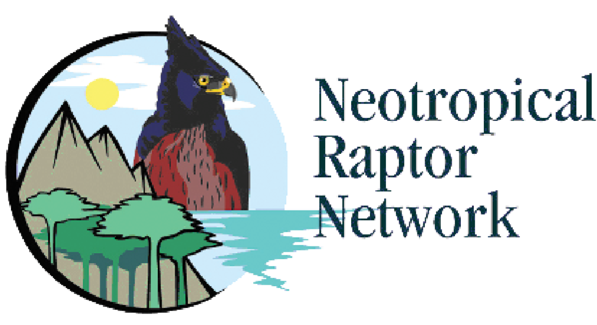
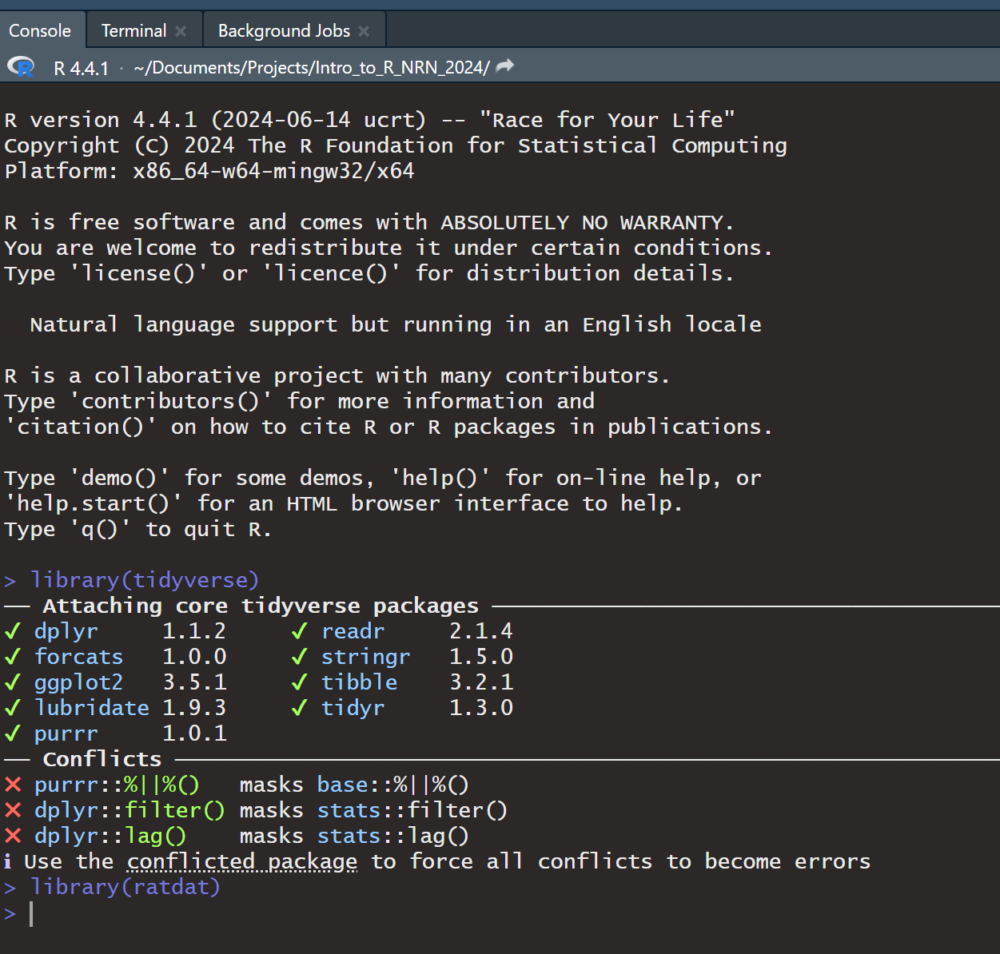
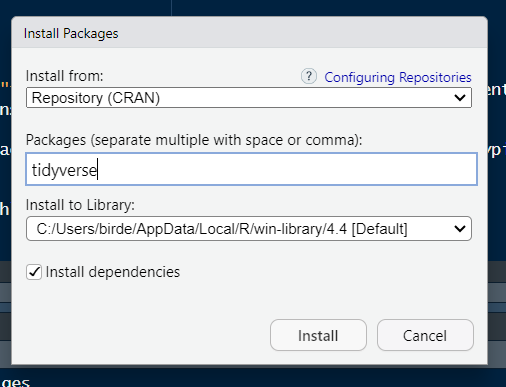
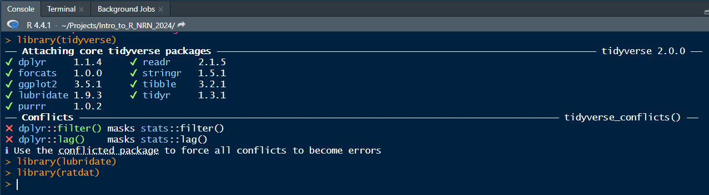
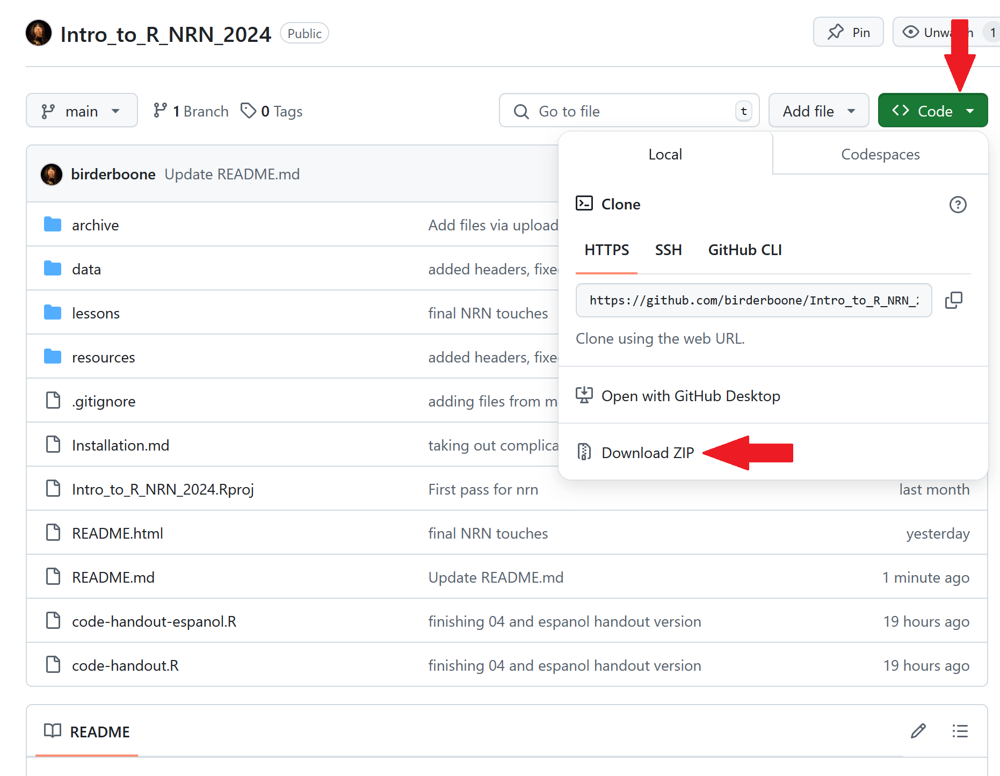

# Data Analysis and Visualization in Ecology with R

This depository contains code and resources associated with the 2024 Neotropical Raptor Network, Oct. 1 2024. 

RStudio is a powerful open-source statistical computing software that can enhance the lives of wildlife
students and professionals. However, new users are often intimidated by the learning curve associated
with studying a programming language and novices tend to lose interest if they do not benefit from their new skills. This introduction to R is designed for participants with no programming experience and assumes no prior knowledge of R or RStudio. The first half of the workshop will begin with the basics of R syntax, the RStudio interface, and then introduce importing files and explore your data. 
The second half will introduce you how to manipulate data, create summary statistics, and plot and visualize your data.

To ask any follow-up questions related to the workshop or general help in R, post in the [Issues](https://github.com/birderboone/Intro_to_R-NRN-2024/issues) tab.

# Before the workshop begins

## Install R and RStudio

*Windows instructions*

- Download R from the [CRAN website](https://cran.r-project.org/bin/windows/base/).
- Run the .exe file that was just downloaded
- Go to the [RStudio download page](https://posit.co/download/rstudio-desktop/#download)
- Under Installers select RStudio x.yy.zzz - Windows Vista/7/8/10 (where x, y, and z represent version numbers)
- Double click the file to install it
- Once it’s installed, open RStudio to make sure it works and you don’t get any error messages.

*Mac instructions*

- Download R from the [CRAN website](https://cran.r-project.org/bin/macosx/).
- Select the .pkg file for the latest R version
- Double click on the downloaded file to install R
- It is also a good idea to install [XQuartz](https://www.xquartz.org/) (needed by some packages)
- Go to the [RStudio download page](https://posit.co/download/rstudio-desktop/#download)
- Under Installers select RStudio x.yy.zzz - Mac OS X 10.6+ (64-bit) (where x, y, and z represent version numbers)
- Double click the file to install RStudio
- Once it’s installed, open RStudio to make sure it works and you don’t get any error messages.
# Install packages

- Open RStudio. 
- In the "console" on the bottom left type `install.packages(c("tidyverse", "ratdat"))` and press enter.

*OR*  

You can install it using rstudios point and click interface clicking on `Packages` then `Install` on the bottom right panel:  

--------------

Then typing in the package name and click `Install`  

--------------

** Note: If you are on windows you may be prompted while installing packages to install R tools. You can do so by going to the 'Install R Tools' here:
https://cran.r-project.org/bin/windows/Rtools/rtools44/rtools.html **  

## Check that packages installed correctly

You can check if the packages installed correctly by typing in the console and pressing enter: `library(tidyverse)`, `library(ratdat)`  

If your packages loaded correctly your console should look roughly like this:

# Download this repository

We're going to use resources in this repository for our workshop, so you'll need to download it to your desktop.

- At the top of the [repository page](https://github.com/birderboone/Intro_to_R_NRN_2024) click `Code` and then click `Download ZIP`

----------------

# Instrucciones en español

## Instalación de R y RStudio

*Instrucciones para Windows*

- R se puede descargar aquí: [Sitio web de CRAN](https://cran.r-project.org/bin/windows/base/).
- Ejecute el archivo .exe.
- RStudio se puede descargar aquí: [Página de descarga de RStudio](https://posit.co/download/rstudio-desktop/#download).
- Ejecute el archivo llamado RStudio x.yy.zzz - Windows Vista/7/8/10 (x, y, z son los números de versión).
- Después de la instalación, abra RStudio para verificar que funcione.

*Instrucciones para Mac*

- R se puede descargar aquí: [Sitio web de CRAN](https://cran.r-project.org/bin/macosx/).  
- Ejecute la última versión .pkg.
- También es recomendable descargar el software [XQuartz](https://www.xquartz.org/) (necesario para algunos paquetes).  
- RStudio se puede descargar aquí: [Página de descarga de RStudio](https://posit.co/download/rstudio-desktop/#download).  
- Ejecute el archivo llamado RStudio x.yy.zzz - Mac OS X 10.6+ (64-bit) (x, y, z son los números de versión).  
- Después de la instalación, abra RStudio para verificar que funcione.

## Instalar los paquetes

- Abra RStudio.  
- En la "consola", en la esquina inferior izquierda, escriba `install.packages(c("tidyverse", "ratdat"))` y pulse "enter".

*O*  

Instale usando RStudio. Pulse `Packages` y luego `Install` en la esquina inferior derecha:  
  

--------------

Escriba el nombre del paquete y pulse `Install`:  

--------------

**Nota: Para Windows, también debe instalar 'RTools'. Puede descargar 'RTools' aquí:  
https://cran.r-project.org/bin/windows/Rtools/rtools44/rtools.html**  

## Verificar si los paquetes se instalaron correctamente

Escriba en la consola y pulse 'Enter': `library(tidyverse)`, `library(ratdat)`.  

La consola se verá así:  

## Descargar el repositorio

Descárguelo para usarlo en el taller:

- En la parte superior de la página del [repositorio](https://github.com/birderboone/Intro_to_R_NRN_2024), pulse `Code` y luego `Download ZIP`.

